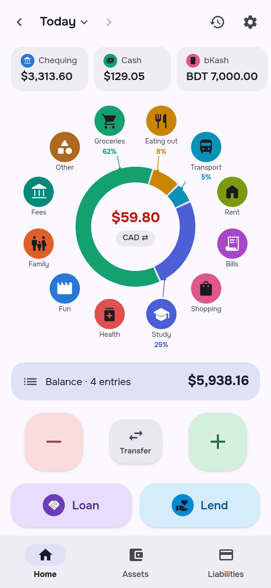
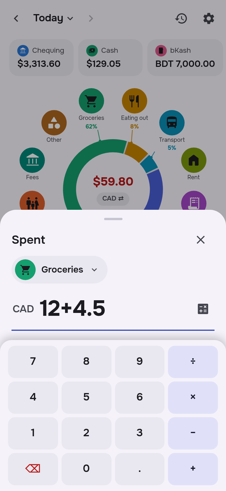
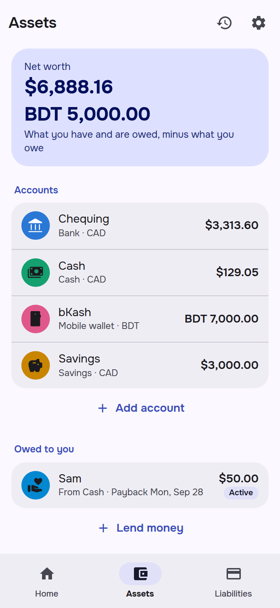
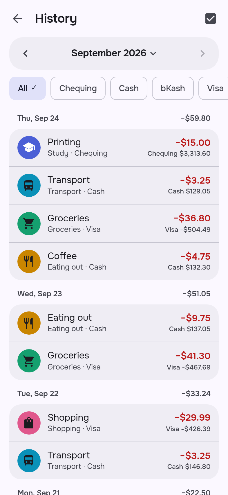

<p align="center">
  
</p>

<h1 align="center">Tally</h1>

<p align="center">
  <b>A pocket notebook for your money.</b> One tap per expense, every account in its own currency, all on your phone.
</p>

<p align="center">
  <a href="https://github.com/IamAndelib/Tally-android/releases/latest"></a>
  <a href="https://github.com/IamAndelib/Tally-android/actions/workflows/build-apk.yml"></a>
  
  <a href="LICENSE"></a>
</p>

<p align="center">
  
  
  
  
</p>

Tally works like a paper notebook: each morning the balance of every money source sits at the top of the page, spending
is written down through the day by category and account, and the balances roll over to the next day. It's built to be
small, calm and fast — no budgets, no charts you have to study, no sign-up.

## Features

**Everyday**

- **One tap per expense.** Up to 24 spending categories sit around a donut of the day's spending. Tap a category, type
  the amount, save. New entries default to the day you're looking at.
- **Every account, every currency.** Bank, mobile wallet (bKash and the like), cash, credit card, savings — or your own
  account types. Each account keeps its own currency (CAD, BDT, USD, … any ISO currency).
- **Morning check.** Once a day Tally lists your balances and asks if they still match.
- **Transfers** between your own accounts never count as spending. Moving money between currencies asks for the amount
  that arrived; an ATM or cash-out fee can be added and is saved as a linked expense.
- **Balance fixes.** When an account doesn't match reality, type what it really holds and Tally records the difference.
- **Built-in calculator** on amount fields (`12+4.50`, `3×2.75`), with a cursor you can move.
- **Overdraw warning.** Accounts other than credit cards warn before a save takes them below zero.

**Loans and net worth**

- **Loans and lendings** per person: money you borrowed or lent, in several draws with their own due dates, partial
  payments, "paid more than owed", write-off / forgive, and reopen.
- **Assets and Liabilities** tabs with net worth per currency, other assets (a laptop, gold, …), cleared loans and
  archived accounts. Drag a row between sections to archive it, mark it cleared or reopen it.

**Looking back**

- **History** for any day, date range or month, filtered by account, with each account's running balance under every
  entry. Hold an entry to select several and delete them together.
- **Spending summary:** tap the donut for the last 7 days, 8 weeks, or a month by category, compared with the period
  before.

**Around the phone**

- **Reminders:** an evening nudge if nothing was written that day, and due-date reminders for loans with *Record
  payment*, *+1 day* and *+1 week* buttons.
- **Home-screen widget** with today's balance, today's spending and a quick-add button.
- **Material You:** follows your wallpaper colours on Android 12+, light and dark themes, and an emblem and colour for
  every category, account and asset.

**Your data**

- Everything stays on the phone. No account, no ads, no analytics, **no network requests**.
- **Backup and restore** (a JSON file you keep anywhere) and **CSV export** of every entry.
- **Undo** for every change.

## Requirements

| | |
| --- | --- |
| **Android** | 7.0 (API 24) or newer |
| **Android System WebView** | version 87 or newer — kept up to date through Google Play on almost every phone |
| **Storage** | about 2 MB for the app, plus your data |
| **Internet** | not needed |
| **Material You colours** | Android 12 or newer (older versions use Tally's own colours) |
| **Notifications** | optional; on Android 13+ Tally asks once, when reminders are first needed |

Tally is a phone app; it runs on tablets and foldables too, laid out for a single column.

## Install

1. On your phone, open the [latest release](https://github.com/IamAndelib/Tally-android/releases/latest) and download
   `Tally-vX.Y.Z.apk`.
2. Open the file. If Android asks, allow your browser or file manager to *install unknown apps*.
3. Open Tally, add the places your money lives with what each holds right now, and you're set.

Updates install over the previous version and keep your data.

<details>
<summary>Verify your download (optional)</summary>

Every release lists the APK's SHA-256 next to it (`Tally-vX.Y.Z.apk.sha256`). Release APKs are signed with this
certificate — Android will also refuse an update that isn't:

```
SHA-256: 9D:B8:C8:9C:59:48:0E:D9:C6:73:D9:B9:6E:C3:F0:82:B2:83:6B:1C:ED:0E:07:A7:DD:41:8B:D1:8D:2F:AC:88
```

Check it with `apksigner verify --print-certs Tally-vX.Y.Z.apk` (Android SDK build-tools).
</details>

<details>
<summary>Coming from a test build?</summary>

Builds from before 1.0.0 were signed with a different key, so Android won't update them to a release. Move your data
once: in the old app, **Settings → Backup**, uninstall it, install the release, then **Settings → Restore from backup**.
Test builds from now on install as a separate app, *Tally Dev*.
</details>

## Privacy

Your data is stored only inside the app on your phone. Tally has no servers and sends nothing anywhere; the page even
carries a Content-Security-Policy that blocks any network request. Uninstalling the app deletes its data, so keep a
backup (**Settings → Backup**). If Android's own device backup is on, Android may include Tally's data in it.

| Permission | Why |
| --- | --- |
| Notifications | the evening nudge and loan due-date reminders (only if you keep them on) |
| Run at startup | to re-arm reminders after the phone restarts |
| Vibrate | a short tick when saving |
| Internet | declared because the app's screen is a WebView; Tally itself makes no network requests |

## Build from source

You need **JDK 17** and the **Android SDK** with platform 34 and build-tools 34.0.0 (Android Studio includes both).

```sh
git clone https://github.com/IamAndelib/Tally-android.git
cd Tally-android
./gradlew assembleDebug        # app/build/outputs/apk/debug/app-debug.apk ("Tally Dev")
```

Or open the folder in Android Studio and run it. Debug builds are signed with the committed `app/debug.keystore` and
install as *Tally Dev* (`app.tally.expenses.dev`), next to the release.

A release build (`./gradlew assembleRelease`) is signed only when `TALLY_KEYSTORE` and `TALLY_KEYSTORE_PASSWORD`
point at a keystore; otherwise it comes out unsigned.

### The app in a browser

The whole interface is plain HTML, CSS and JavaScript in `app/src/main/assets` (no framework, no build step), so you can
work on it in a desktop browser:

```sh
cd app/src/main/assets && python3 -m http.server 8000   # then open http://localhost:8000
```

Without the Android shell there are no notifications, widget or file saving, and the colours are the baseline scheme.

### Tests and checks

```sh
cd tests
npm ci
npx playwright install chromium   # once
npm test                          # end-to-end suites in headless Chromium
npm run lint                      # ESLint across the scripts in load order + Prettier check
npm run format                    # apply Prettier
```

CI runs the same checks on every push, builds the APKs, and publishes the latest test build of each branch to the
[`builds`](https://github.com/IamAndelib/Tally-android/tree/builds) branch.

## Project layout

```
app/src/main/
  assets/                 the app itself (a web page shown in a WebView)
    index.html            page shell: loads the styles and the scripts below, in order
    css/colors.css        Material 3 colour roles (light/dark baseline)
    css/app.css           all other styles
    js/                   plain scripts sharing one global scope, one file per area:
                          core, state, theme, period, layers, emblems, calculator, ring,
                          loans, sheets, summary, screens, bridge, backup, gestures, events, main
    js/icons.js           Material Symbols subset (generated by tools/gen_icons.py)
    fonts/                Onest (bundled, SIL OFL)
  java/app/tally/expenses/
    MainActivity.java     the WebView shell and the window.Android bridge
    ReminderReceiver.java notifications and alarms;  BootReceiver.java re-arms them
    TallyWidget.java      home-screen widget;        QuickAddActivity.java its + dialog
tests/                    end-to-end tests (Playwright) and lint
tools/gen_icons.py        regenerates js/icons.js
```

See [CONTRIBUTING.md](CONTRIBUTING.md) for how the pieces fit together and how to propose changes.

## Releasing

1. In a pull request, bump `tallyVersion` in `gradle.properties` and add its section to `CHANGELOG.md`.
2. Merge it into `main`. When `main` carries a version that has no release yet, CI builds and signs the release (key
   from the `RELEASE_KEYSTORE_BASE64` and `RELEASE_KEYSTORE_PASSWORD` repository secrets), verifies the signature,
   and publishes the GitHub Release `vX.Y.Z` — tag, APK, SHA-256 and the changelog section as notes.

Pushing a tag `vX.Y.Z` that matches the version does the same.

## License

Tally is released under the [MIT License](LICENSE). It includes Material Symbols (Apache 2.0) and the Onest typeface
(SIL Open Font License 1.1) — see [THIRD_PARTY_NOTICES.md](THIRD_PARTY_NOTICES.md).

Made by [IamAndelib](https://github.com/IamAndelib).
